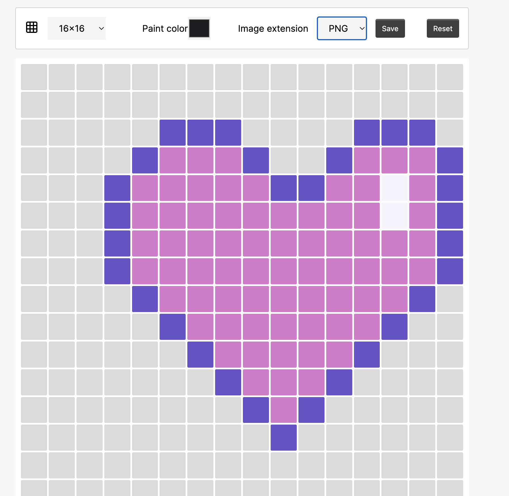

## Pixel Art Web app

### Created Using HTML, CSS, and Vanilla JavaScript

I used this library: https://github.com/tsayen/dom-to-image for convert HTML DOM element to bitmap data specific base64 data.

Live demo - https://pixel-arty.netlify.app/

